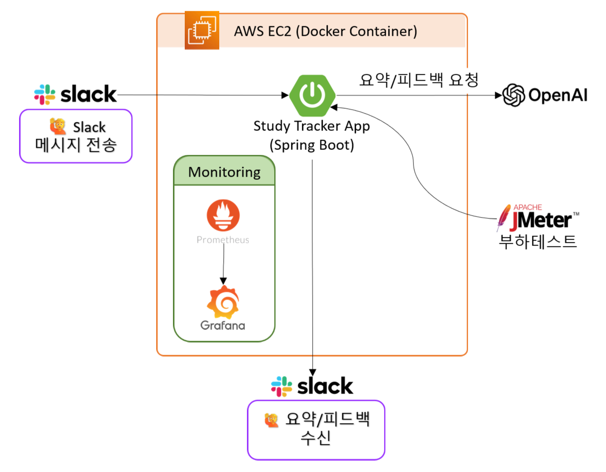

# Study Tracker 

### 개요 
Slack으로 기록하면, AI가 요약과 피드백을 써주는 스터디 트래커


### 목표

- 학습자의 Slack 메시지를 자동 기록 및 분석
- OpenAI를 활용한 요약과 피드백 자동 생성
- 매일/매주/매월 자동 Slack 전송 기능
- 프론트엔드 없이 Slack만으로 간결한 UX 제공


### 주요 기능

- Slack 메시지 수신 -> DB 저장
- 스케줄 기반 요약 생성 (일간/주간/월간)
- OpenAI API를 통한 요약/피드백 생성
- Slack DM 자동 발송
- 실패 요청 재시도 (Redis 기반 큐 사용)
- 사용자 중복 요청 방지 및 동시성 처리

### 시스템 아키텍처



- 사용자가 Slack에 학습 내용을 입력
- Study Tracker 앱이 메시지를 수신하고 DB에 저장
- 매일/매주/매월 Scheduler가 OpenAI에 요청하여 요약/피드백 생성
- 결과를 Slack DM으로 전송
- Redis를 활용한 실패 재시도 및 Prometheus/Grafana를 통한 모니터링 지원

### 주요 유즈케이스

#### 1. Slack 메시지 수신 및 저장
- 사용자가 전송한 Slack 메시지를 시스템이 수신  
- 내부의 StudyMessageFilter를 통해 학습 관련 메시지만 선별하여 H2 DB에 저장


#### 2. 요약/피드백 생성 및 Slack 전송
- 스케줄러가 작동하여 저장된 학습 로그를 기반으로 OpenAI에 요약/피드백을 요청  
- Slack DM을 통해 사용자에게 전달  
- 요약 실패 시 Redis 큐에 저장되며, 5분마다 재시도 로직이 동작


### 기술 스택
- Language : Java 21
- Framework : Spring Boot 3.4.4
- Build : Gradle
- External API : Slack API, OpenAI API (GPT-4o-mini)
- Persistence : Spring Data JPA
- Infra & DevOps : AWS EC2, Docker, Spring Scheduler, WebClient, Redis (재시도 큐), Prometheus, Grafana, JMeter


### 테스트
- Slack 이벤트 수신부터 DB 저장, 요약 생성, Slack 전송까지의 주요 흐름을 단위/통합 테스트로 검증했음
- 외부 API는 MockWebServer로 모킹했으며, Redis 기반 재시도 큐와 예외 처리 로직도 테스트 커버리지에 포함됨


### 실행 방법 
1. 환경 변수 설정 (최초 1회)

아래 항목을 `.env`에 설정:
```
   SLACK_BOT_TOKEN=your_slack_bot_token
   SLACK_SIGNING_SECRET=your_slack_signing_secret
   OPENAI_API_KEY=your_openai_api_key
```

2. 로컬 서버 실행 : 
```bash
./gradlew bootRun
```

3. Slack Event 설정
- [Slack API 설정 페이지](https://api.slack.com/apps)에서 이벤트 구독을 활성화
- `https://xxxx.ngrok-free.app/slack/events` 형식의 URL을 등록
- ngrok 무료 플랜은 실행시 매번 주소가 바뀌므로 Slack 설정도 함께 갱신해야 함

4. Docker 기반 서비스 실행(선택 사항)
- 이 프로젝트는 통합 테스트 및 모니터링을 위한 `docker` 프로파일을 제공함
- `docker` 프로파일은 다음 구성요소를 함께 실행:
    - Redis (요약 재시도 큐)
    - Prometheus / Grafana (모니터링)
    - Application (Spring Boot)
- 실행 명령어:
```bash
docker compose up -d --build
docker compose down
```

### 설계 인사이트

- 스케줄러 기반의 절차적/동기 구조를 중심으로 설계
- 요약 실패 요청은 Redis 큐를 사용해 at-least-once 재처리 (Producer-Consumer 패턴 일부 적용)
- 부하 테스트 결과, 스케줄러 병목 및 WebClient 재시도 폭주 등 동기 흐름의 한계를 경험
- 이벤트 기반 아키텍처로의 전환 가능성(E.g. Spring Event, Kafka)을 탐색하며 트레이드오프 인식


### 회고 및 인사이트

- 절차적/동기 구조 기반 설계를 통해 전체 흐름을 구성함
- Redis 큐를 활용해 실패 요청의 비동기 재시도를 구현하며 EDA 개념 일부 적용
- 절차적 구조와 이벤트 기반 구조의 트레이드오프를 설계 문서로 비교 분석
- 동기 흐름의 병목 및 트래픽 처리 한계를 부하 테스트로 정량 분석


👉 자세한 설계 및 성능 회고는 다음 문서에 정리됨:
- [이벤트 기반 설계 적용과 회고](./reports/study-tracker-eda-review.pdf)
- [부하 테스트 보고서](./reports/study-tracker-loadtest.pdf)


