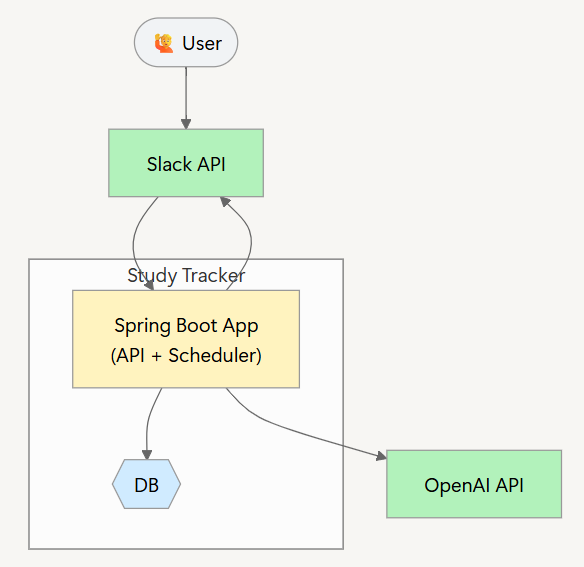

# Study Tracker 

**Slack 기반 스터디 트래커**  
개인의 학습 로그를 Slack으로 수집하고, 매일/매주/매월 AI가 요약 및 피드백을 자동 제공하는 프로젝트입니다.
프론트엔드 없이 Slack을 인터페이스로 사용하고, OpenAI API와 연동하여 AI 생성 메시지를 주는 백엔드 중심 구조입니다.

---

## 목표

- **학습 습관 형성 지원**: 학습한 내용을 Slack에 남기기만 하면 자동으로 기록 및 요약됩니다.
- **AI 메시지 제공**: OpenAI API를 활용해 요약과 동기부여 피드백을 생성해 Slack으로 전송합니다.

## 프로젝트 구조 (Architecture)

- Slack에서 사용자의 학습 메시지를 수신
- 메시지를 DB에 저장
- 일, 주, 월마다 특정 시간대에 스케줄러가 실행됨
- OpenAI API로 요약 및 피드백 생성
- 생성된 결과를 다시 Slack으로 전송

---

## 기술 스택
- Language : Java 21
- Framework : Spring Boot 3.4.4
- Build : Gradle
- External API : Slack API, OpenAI API (GPT-4o-mini)
- Persistence : Spring Data JPA
- Etc : Spring Scheduler, WebClient

